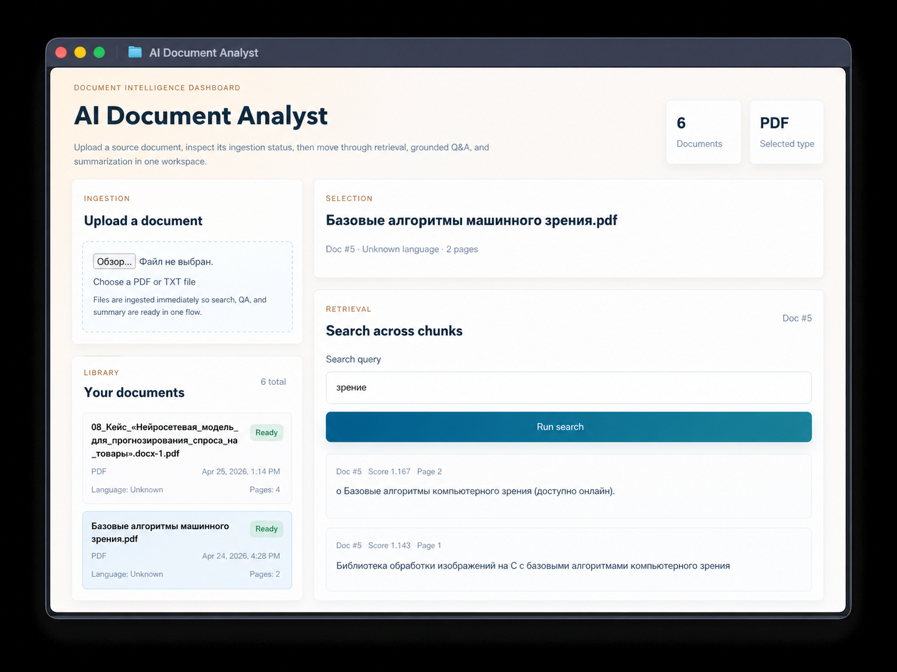
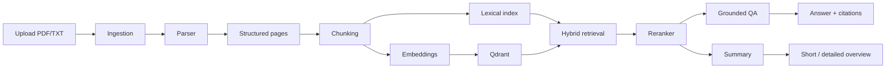
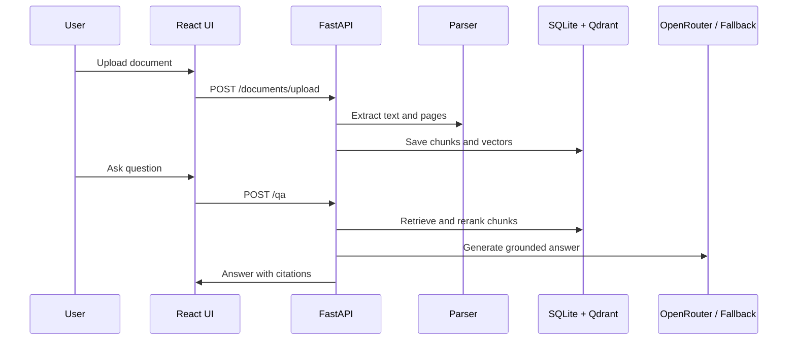

# AI Document Analyst


**Language:** English | [Русский](docs/README.ru.md) | [中文](docs/README.zh.md)

AI Document Analyst is a document analysis service for uploading source files, indexing their content, searching relevant fragments, asking grounded questions, and generating summaries.



## ✨ Highlights

- 📄 Upload and process `PDF` and `TXT` documents
- 🔎 Search by meaning across document chunks
- 🧠 Ask questions and get citation-backed answers
- 🧾 Generate short and detailed summaries
- 🧩 Preserve metadata: document id, page, section, chunk index
- 🌍 Switch the UI between English, Russian, and Chinese
- 🗑️ Delete documents from the library, including DB records and vector entries
- 🐳 Run the whole stack with Docker Compose

## 🧭 Overview

The application is organized as a document intelligence pipeline:

- ingestion and parsing
- chunking with source metadata
- embeddings and vector storage
- hybrid retrieval with lexical support
- reranking before generation
- grounded answers with citations
- API, frontend, tests, and Docker deployment

## 🏗️ Architecture



## 🔁 Main Flow



## 🧠 How It Works

**Ingestion.** Files are uploaded through FastAPI, saved under `storage/`, parsed, split into chunks, and persisted with page-level metadata.

**Retrieval.** Search combines vector similarity from Qdrant with lightweight lexical scoring. This helps with real-world phrasing and Russian word forms such as `неделя` / `недели`.

**Reranking.** Retrieved chunks are reordered before answer generation so the QA layer receives cleaner evidence.

**Grounded QA.** Answers are generated from retrieved chunks and returned with source snippets. If evidence is weak, the system falls back to a cautious "not enough evidence" response.

**LLM integration.** If `OPENROUTER_API_KEY` is configured, QA and summaries use OpenRouter for more natural output. If not, local fallback logic keeps the demo usable.

## 🧰 Tech Stack

| Area | Technologies |
| --- | --- |
| Backend | Python, FastAPI, Pydantic, SQLAlchemy |
| Storage | SQLite, local file storage |
| Retrieval | Qdrant, hybrid lexical + vector retrieval |
| AI layer | configurable embeddings, reranking, OpenRouter |
| Frontend | React, TypeScript, Vite, custom CSS |
| Infra | Docker, Docker Compose |
| Tests | Pytest, Vitest, Testing Library |

## 📁 Project Structure

```text
backend/
  app/
    api/            FastAPI routes
    core/           settings and database setup
    db/             SQLAlchemy models
    schemas/        request / response contracts
    services/       parsing, chunking, retrieval, QA, summary
  tests/            backend tests

frontend/
  src/
    components/     dashboard panels
    hooks/          document and mutation state
    lib/            API client
    i18n.tsx        EN / RU / ZH localization

docs/
  assets/           screenshots and documentation media

storage/
  raw/              uploaded files
  processed/        derived artifacts
```

## 🚀 Run Locally

Create environment file:

```bash
cp .env.example .env
```

Start the stack:

```bash
docker compose up --build
```

Open:

- Frontend: `http://localhost:5173`
- Backend API: `http://localhost:8000`
- Health check: `http://localhost:8000/health`
- Qdrant: `http://localhost:6333`

If default ports are busy:

```bash
BACKEND_PORT=18000 FRONTEND_PORT=15173 docker compose up --build
```

## ⚙️ Configuration

Useful environment variables:

- `DATABASE_URL`
- `QDRANT_URL`
- `STORAGE_ROOT`
- `CHUNK_SIZE`
- `CHUNK_OVERLAP`
- `RETRIEVAL_TOP_K`
- `ANSWER_TOP_K`
- `EMBEDDING_MODEL_NAME`
- `OPENROUTER_API_KEY`
- `OPENROUTER_MODEL`

The default `EMBEDDING_MODEL_NAME=hashing-384` keeps the local Docker build lightweight. For stronger semantic quality, swap it for a multilingual embedding model.

## 🔌 API

| Method | Endpoint | Purpose |
| --- | --- | --- |
| `GET` | `/health` | Service health check |
| `POST` | `/documents/upload` | Upload and ingest a document |
| `GET` | `/documents` | List uploaded documents |
| `GET` | `/documents/{id}` | Get document metadata |
| `DELETE` | `/documents/{id}` | Delete document and indexed chunks |
| `POST` | `/search` | Semantic / hybrid chunk search |
| `POST` | `/qa` | Grounded question answering |
| `POST` | `/summary` | Short or detailed summary |

## ✅ What To Try

1. Upload a PDF or TXT file.
2. Search for an exact phrase and then a paraphrase.
3. Ask a factual question and inspect citations.
4. Ask something unsupported and confirm the system refuses to invent.
5. Generate short and detailed summaries.
6. Switch language in the UI.
7. Delete a document from the library.

## 🧪 Tests

Backend:

```bash
cd backend
pytest
```

Frontend:

```bash
cd frontend
npm test
npm run build
```

## 🗺️ Scope And Roadmap

- OCR for scanned PDFs and images
- DOCX, PNG, and JPG ingestion
- contract or invoice extraction schemas
- stronger multilingual embeddings
- document viewer with page-level highlights
- evaluation benchmark for retrieval, QA, and extraction
