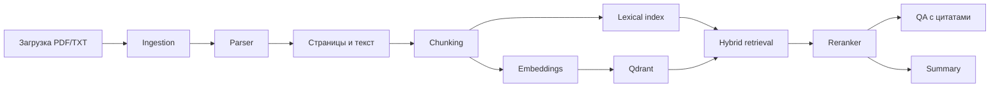

# AI Document Analyst


**Язык:** [English](../README.md) | Русский | [中文](README.zh.md)

AI Document Analyst — это MVP документно-аналитической платформы: сервис загружает документы, разбирает их на фрагменты, ищет по смыслу, отвечает на вопросы с цитатами и делает summary.


## ✨ Возможности

- 📄 загрузка `PDF` и `TXT`
- 🔎 semantic / hybrid search по чанкам
- 🧠 ответы на вопросы по документу
- 📌 цитаты и source snippets для проверки ответа
- 🧾 короткое и подробное summary
- 🌍 интерфейс на английском, русском и китайском
- 🗑️ удаление документов из UI, базы и vector store
- 🐳 запуск через Docker Compose

## 🧭 Суть проекта

Это не просто “чат с PDF”. Проект показывает полноценный AI pipeline для документов:

- ingestion
- parsing
- chunking
- embeddings
- vector search
- lexical search
- reranking
- grounded QA
- summarization
- frontend demo
- tests and Docker deployment

Такой проект хорошо выглядит в портфолио, потому что демонстрирует не только работу с LLM, но и инженерную архитектуру вокруг Retrieval-Augmented Generation.

## 🏗️ Архитектура



## 🧰 Стек

| Часть | Технологии |
| --- | --- |
| Backend | Python, FastAPI, Pydantic, SQLAlchemy |
| Storage | SQLite, local file storage |
| Retrieval | Qdrant, hybrid lexical + vector retrieval |
| AI layer | embeddings, reranking, OpenRouter |
| Frontend | React, TypeScript, Vite |
| Infra | Docker, Docker Compose |
| Tests | Pytest, Vitest, Testing Library |

## 🚀 Запуск

```bash
cp .env.example .env
docker compose up --build
```

По умолчанию:

- Frontend: `http://localhost:5173`
- Backend: `http://localhost:8000`
- Health: `http://localhost:8000/health`

Если порты заняты:

```bash
BACKEND_PORT=18000 FRONTEND_PORT=15173 docker compose up --build
```

## 🔌 API

| Метод | Endpoint | Назначение |
| --- | --- | --- |
| `GET` | `/health` | проверка сервиса |
| `POST` | `/documents/upload` | загрузить документ |
| `GET` | `/documents` | список документов |
| `DELETE` | `/documents/{id}` | удалить документ |
| `POST` | `/search` | поиск по чанкам |
| `POST` | `/qa` | вопрос-ответ с citations |
| `POST` | `/summary` | summary документа |

## ✅ Что проверить в демо

1. Загрузить PDF или TXT.
2. Найти точную фразу и переформулированный запрос.
3. Задать вопрос и проверить citations.
4. Спросить то, чего нет в документе.
5. Сгенерировать short и detailed summary.
6. Переключить язык интерфейса.
7. Удалить тестовый документ.

## 💼 Формулировка для резюме

> Built a production-style AI document analysis platform with FastAPI, React, Qdrant, hybrid retrieval, grounded QA with citations, LLM-assisted summaries, Docker deployment, and multilingual UI support.
