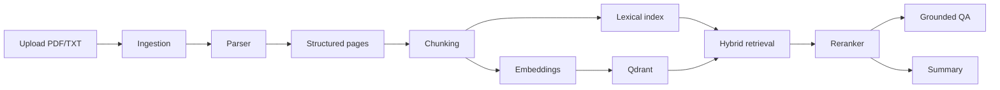

# AI Document Analyst


**Language:** [English](../README.md) | [Русский](README.ru.md) | 中文

AI Document Analyst 是一个文档智能分析 MVP：它可以上传文档、解析文本、切分内容、语义检索、基于证据回答问题，并生成摘要。


## ✨ 功能

- 📄 上传 `PDF` 和 `TXT`
- 🔎 对文档片段进行语义 / 混合检索
- 🧠 基于文档内容回答问题
- 📌 返回 citations 和 source snippets
- 🧾 生成短摘要和详细摘要
- 🌍 支持英文、俄文、中文界面
- 🗑️ 从 UI、数据库和 vector store 删除文档
- 🐳 使用 Docker Compose 一键运行

## 🧭 项目定位

这不是简单的 “PDF 聊天机器人”。项目展示的是一个完整的文档 AI pipeline：

- ingestion
- parsing
- chunking
- embeddings
- vector search
- lexical search
- reranking
- grounded QA
- summarization
- frontend demo
- tests and Docker deployment

它适合作为 AI engineering、RAG、后端工程和文档处理方向的作品集项目。

## 🏗️ 架构



## 🧰 技术栈

| 模块 | 技术 |
| --- | --- |
| Backend | Python, FastAPI, Pydantic, SQLAlchemy |
| Storage | SQLite, local file storage |
| Retrieval | Qdrant, hybrid lexical + vector retrieval |
| AI layer | embeddings, reranking, OpenRouter |
| Frontend | React, TypeScript, Vite |
| Infra | Docker, Docker Compose |
| Tests | Pytest, Vitest, Testing Library |

## 🚀 本地运行

```bash
cp .env.example .env
docker compose up --build
```

默认地址：

- Frontend: `http://localhost:5173`
- Backend: `http://localhost:8000`
- Health: `http://localhost:8000/health`

如果端口被占用：

```bash
BACKEND_PORT=18000 FRONTEND_PORT=15173 docker compose up --build
```

## 🔌 API

| Method | Endpoint | Purpose |
| --- | --- | --- |
| `GET` | `/health` | service health |
| `POST` | `/documents/upload` | upload document |
| `GET` | `/documents` | list documents |
| `DELETE` | `/documents/{id}` | delete document |
| `POST` | `/search` | chunk retrieval |
| `POST` | `/qa` | grounded QA |
| `POST` | `/summary` | document summary |

## ✅ Demo Checklist

1. 上传 PDF 或 TXT。
2. 搜索精确短语和改写后的问题。
3. 提问并检查 citations。
4. 询问文档中不存在的信息。
5. 生成 short 和 detailed summary。
6. 切换界面语言。
7. 删除测试文档。

## 💼 Resume Summary

> Built a production-style AI document analysis platform with FastAPI, React, Qdrant, hybrid retrieval, grounded QA with citations, LLM-assisted summaries, Docker deployment, and multilingual UI support.
